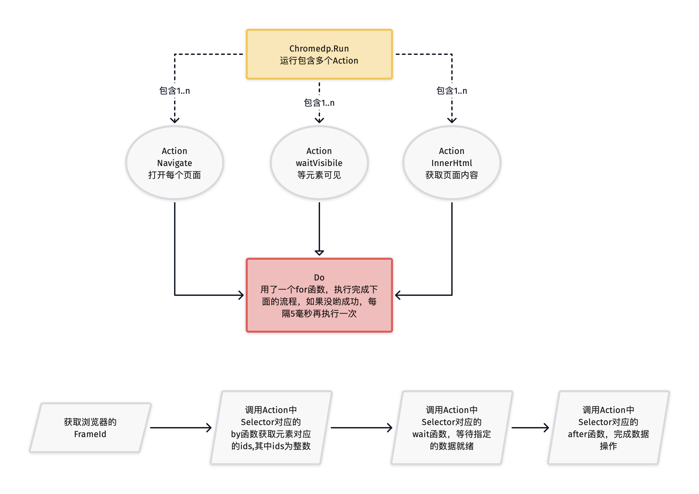

# 梅尔卡巴(merkaba)


```
  梅尔卡巴是一个互转的光场,转化能量
  RPA的自动化引擎（浏览器和移动APP）由梅尔卡巴驱动
  
```
* chromedp的框架运行流程
  


* go: malformed module path "merkaba/chromedp": missing dot in first path element
  go: merkaba/chromedp@v1.0.0: malformed module path "merkaba/chromedp": missing dot in first path element
```
需要在相应模块的go.mod文件里面增加
replace merkaba/chromedp => /workspace/xpa/go/merkaba/src/chromedp

```

* 如何在终端启动merkaba应用?
 ```
1）vi /etc/ssh/sshd_config
  X11Forwarding yes
  X11DisplayOffset 10
  X11UseLocalhost yes
2）sudo service ssh restart
3）配置SecureCRT：Connection->Port Forwarding->Remote/X11->选中Forward X11 Packets
4）在主屏幕启动merkaba
  ./start.sh

5）创建一个自己的屏幕启动
  #安装xvfb
  sudo apt install xvfb
  #创建一个编号为10的2k屏幕（4k=3840x2160x32）
  sudo Xvfb :1 -ac -screen 0 2560x1440x24 &
  DISPLAY=:1 nohup ./merkaba &

6) 查看系统有多少个屏幕及编号
  ls /tmp/.X11-unix    
  

7) 浏览器查看
 --安装X11vnc服务器
export DEBIAN_FRONTEND=noninteractive
apt-get install -y x11vnc

 --然后启动 x11服务器：
x11vnc -display :1 -forever -shared -noipv6 -passwd xiaoming

 --最后，我们通过noVNC服务器，将 VNC翻译为HTML服务，

安装：
  apt-get install -y novnc
,然后启动：
  websockify --web /usr/share/novnc 8080 localhost:5900  


```
  go: merkaba/chromedp@v1.0.0: malformed module path "merkaba/chromedp": missing dot in first path element


* 三个重要的环境变量配置
```
export GO111MODULE=on
export GOPROXY=https://goproxy.cn
#设置cache路径
export GOMODCACHE=/Users/xm


```

* 安装Opencv4,(No package 'opencv' found)
```
find / -name opencv4.pc
==>/usr/local/Cellar/opencv/4.4.0_2/lib/pkgconfig/opencv4.pc
vi ~/.zshrc
export PKG_CONFIG_PATH="$PKG_CONFIG_PATH:/usr/local/Cellar/opencv/4.4.0_2/lib/pkgconfig"

```

*  Run/Debug Configurations 在 Configuration 栏目下 
```
配置 Environment：GOARCH=arm64 Apply -> OK

```

* apple m1芯片不能debug调试的解决方法
```
1)检查go环境,
(base) ➜  ~ go env
GO111MODULE="on"
GOARCH="arm64"   

2)安装delve
GOOS=darwin GOARCH=arm64 go install github.com/go-delve/delve/cmd/dlv@latest
# cd delve/cmd/dlv/
会在你的用户根目录下生成dlv文件。将文件拷贝到你的go-sdk/bin目录

3)编辑 edit custom properties,增加
dlv.path=/workspace/go-sdk/go1.19/bin/dlv
4)Preferences -> Go -> Build Tags & Vendoring, then on Arch, update the value to arm64.
5)在应用的调试的工具栏，edit configuration....
  设置Enviroment,增加 GOARCH="arm64"

```

动态库的配置
===

```
对于windows来说，可以将动态库和可执行程序放到同一个目录，或者将动态库所在的目录绝对路径添加到PATH环境变量中。
对于macOS来说，需要设置DYLD_LIBRARY_PATH环境变量。
export DYLD_LIBRARY_PATH="$DYLD_LIBRARY_PATH:/workspace/xpa/go/merkaba/libs/"
而对于Linux系统来说，需要设置LD_LIBRARY_PATH环境变量。
https://blog.csdn.net/weixin_43128854/article/details/122956384
```
